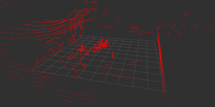
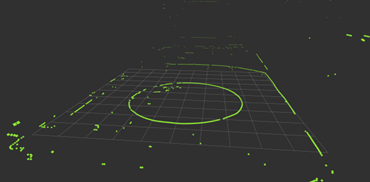
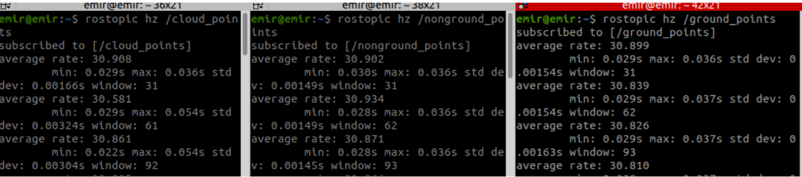

# Ground Segmentation Using RANSAC

This repository provides an implementation of **High-Frequency Ground Segmentation** using a **RANSAC-based approach**.  
The method is designed to efficiently segment ground and obstacles from 3D point cloud data collected from LiDAR sensors.

## Paper

This implementation is based on the following research:

➡ [**High-Frequency Ground Segmentation for Autonomous Mobile Robots: A RANSAC-Based Approach**](https://www.researchgate.net/publication/387781572_High-Frequency_Ground_Segmentation_for_Autonomous_Mobile_Robots_A_RANSAC-Based_Approach)

|  |  |
|:--:|:--:|

## Features

- Uses **RANSAC (Random Sample Consensus)** to estimate a **ground plane** from point cloud data.
- Applies **height filtering** to refine the input data before processing.
- Segments the **ground** and **obstacles** efficiently.
- Publishes the segmented point clouds to separate ROS topics for further processing.
- Designed for **high-frequency** real-time applications.



## Installation

### Prerequisites

Ensure you have the following installed:
- **ROS (Robot Operating System)**
- **PCL (Point Cloud Library)**
- **C++ (with ROS CMake)**

### Cloning and Building the Package

```bash
cd ~/catkin_ws/src
git clone https://github.com/emirhancibir/ground_segmentation.git
cd ~/catkin_ws
catkin_make
source devel/setup.bash
```

## Usage

### Running the Node

To start the ground segmentation node:

```bash
rosrun ground_segmentation ground_segmentation_with_ransac
```

Or using the launch file:

```bash
roslaunch ground_segmentation ground_segmentation.launch
```

### Parameters (can be modified in the launch file)

- `distance_threshold`: RANSAC inlier threshold (e.g., `0.05`)
- `z_threshold`: Height-based filtering threshold (e.g., `0.3`)
- `normal_angle_threshold`: Minimum Z-normal alignment for valid planes (cosine of angle)

### Subscribed Topic

- **`/cloud_all_fields_fullframe`**: Input point cloud (configurable via `input_topic` param)

### Published Topics

- **`/ground_points`**: Segmented ground points
- **`/nonground_points`**: Segmented obstacle points

### Visualizing in RViz

To visualize the segmented results:

```bash
rosrun rviz rviz
```

Then add the following **PointCloud2** display topics:
- `/ground_points`
- `/nonground_points`


## Author

- **Emirhan Cıbır** – [@emirhancibir](https://github.com/emirhancibir)

## License

This project is licensed under the **MIT License**.
